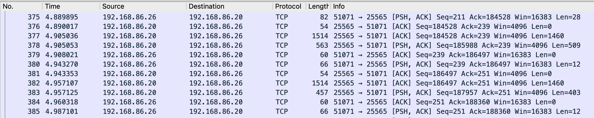
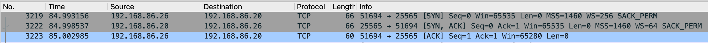

# Homelab Networking Security & Traffic Analysis

This project documents my analysis of a self-hosted Minecraft server running on macOS.

I originally configured the server using traditional port forwarding. I am using this server as a practical environment to learn network security concepts, including TCP/IP, packet analysis, NAT, firewall configuration, and secure remote access.

## Current Setup

- **Host OS: macOS**
- **Server: All the Mods 10 (ATM10)**
- **Protocol: TCP**
- **Port: 25565**
- **Remote Access: Router port forwarding**
- **Traffic Analysis: Wireshark**

## Network Topology

Current network configuration:

    Remote Minecraft Client 
            |
            |
            |
        Internet
            |
            v
        Home Router
            |
            | NAT / Port Forwarding
            v
        macOS Host
            |
            | TCP/25565
            v
        ATM10 Server

## Wireshark Traffic Analysis

I captured network traffic between a Minecraft client and the server using Wireshark. 

In order to isolate Minecraft traffic, I used the following filter within Wireshark.

    tcp.port == 25565

This isolated TCP traffic associated with port 25565, allowing me to analyze communication between the Minecraft client and server.

I observed bidirectional TCP traffic between the client and server. Network activity continued while the player was connected. I also observed occasional TCP retransmissions during the capture. Changes in network traffic occurred as the player interacted with the server. I compared TCP traffic during idle and active gameplay. Increased network activity was observed during player interactions, demonstrating the exchange of application data between the client and server.

192.168.86.26 (Client) --> 192.168.86.20 (ATM Server)

## TCP three-way handshake established

I observed the TCP three-way handshake being established. This includes the packets:

1. **SYN** - The client requests a connection to the server.
2. **SYN-ACK** - The server acknowledges the request and responds.
3. **ACK** - The client acknowledges the server's response.

After this exchange, the TCP connection is established, and Minecraft application data can then be transmitted.

## Security Analysis 

The server is currently accessible through TCP port 25565 using router port forwarding. 

I will continue to test and examine the security implications of this configuration and methods of reducing network exposure.

## Planned Objectives
- [x] Configure and operate the server
- [x] Configure remote access through port forwarding
- [x] Capture network traffic using Wireshark
- [x] Capture and document the TCP three-way handshake
- [ ] Evaluate macOS firewall configurations
- [ ] Test external exposure of the Minecraft service
- [ ] Evaluate Tailscale as an alternative to public port forwarding
- [ ] Compare traffic and accessibility before and after security changes

## Skills and Concepts

This project began as a fun hobby to host a server for a group of people. Over time, it developed into a project to develophands-onn experience with:

- TCP/IP
- Client-server networking
- Network ports
- NAT and port forwarding
- Wireshark
- Packet analysis 
- Network security fundamentals